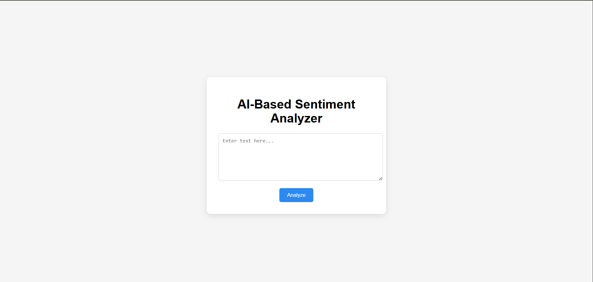

# AI-Based Sentiment Analyzer

📌 **Project Description**  
This project is an AI-based sentiment analysis tool developed using Python. It analyzes text data from social media posts or product reviews and classifies it as **Positive**, **Negative**, or **Neutral**.

The application provides visualized sentiment reports and stores analysis history in a MongoDB database. This project demonstrates natural language processing, AI model integration, web development with Flask, and data visualization concepts.

🛠 **Technologies Used**  
- Python  
- Transformers & Hugging Face  
- Flask  
- MongoDB  
- HTML, CSS, JavaScript  

📸 **Project Output Screenshots**  
🔹 **Web Interface**  
*Web Input Form Screenshot*

🔹 **Sentiment Analysis Result**  
*Sentiment Score & Classification Screenshot*

🔹 **Visualized Reports**  
*Charts Showing Sentiment Distribution Screenshot*

✅ **Outcome**  
The project successfully performs sentiment analysis, classifies text into positive, negative, or neutral categories, visualizes sentiment trends, and stores analysis history for further reference.
